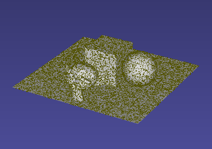

### Uniform point sampling on mesh surface

Example command: 
```
./mesh_pcl --mesh resources/dummy.obj --out /tmp/mesh_pcl/out.ply --density=300 --binary
```



### Mesh-to-mesh distance

### Point-cloud-to-mesh distance
